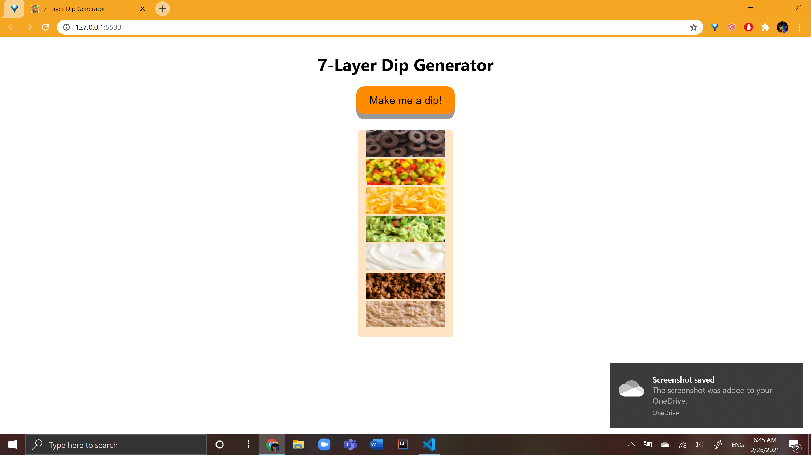

# 7-Layers-Of-Markov
 A simple webapp that generates and displays a 7-layer dip using Markov Chains!  
 
7-layer dips are randomly generated in two parts - their base ingredients + garnishes.

|**Base ingredients**|**Garnishes**|
| --- | --- |
| RB, Refried Beans| OL, Olives |
| SC, Sour cream   | GO, Green onion |
| SS, Salsa        | JP, Jalapenos |
| GC, Guacamole    | TM, Tomatoes |
| SM, Seasoned meat| CH, Cheese |
| HM, Hummus       | CL, Cilantro |
| PY, Plain Yogurt | DP, Diced peppers |

  A base ingredient and garnish are selected to start and the remaining
layers are randomly chosen using a Markov chain. Ingredient images
have been pulled from online and resized courtesy of Wruff Pty Ltd's very 
useful [batch resizing tool](https://bulkresizephotos.com/en).

## How to set up and run the code~
You can view this project on your local through the VSCode Extension: [Live Server](https://marketplace.visualstudio.com/items?itemName=ritwickdey.LiveServer)

1) Clone this repo to your local machine
2) Open the repo in VSCode
3) Click on the "Go Live" button in the bottom-right corner of your client

Alternatively, you can visit: https://jlin-orange.github.io/7-Layers-Of-Markov/

## Personal Significance 
I enjoy silly websites^, and I wanted to make something
simple and fun that would combine personal interests with my 
current technical know-how. Whenever I cook, I like to 
look at a variety of recipes to see the difference in technique
and ingredients used. After learning about Markov chains,
I realized I could probably mimic this sort of exploration 
on a website for the greater good (but mostly my personal interest). 

^ - https://theuselessweb.com/sites/ 

## Challenges faced
I haven't had much experience with Web Development outside of
Hackathons so this was a valuable opportunity for me to formally
approach a web project with thorough documentation and thought. 
JavaScript is still a very new language to me, so it was a challenge
figuring out how I could implement Markov Chains using JS Objects
as opposed to the Dictionary structures available in languages like
Java/Python. I had a fun time scouring Stack Overflow and Google to
find the resources/answers I needed to make things work!
Moving forward, I want to explore Javascript libraries and/or frameworks
to see what they're capable of and how they compare to vanilla Javascript.

## Is this a Creative System?
I believe this is a Creative system according to the characteristics of
novelty, value, intentionality; this system varies with regards to how
well it exhibits each of these. The domain of this system is at the 
intersection of culinary recipes and visual art. 

This is the first time I've worked on a project in this domain and, as far
as I'm aware, I've yet to see a project so dedicated to the 7-layer dip. 
Since this project is relatively small in size, I would say that it's value
is restricted to its aesthetic side. Still, I could see a potential application
for 7-layer aficionados to spice up their 7-layer dip game by using this to explore
different combinations/ratios of ingredients. I weighted the transition matrix 
for the Markov chains according to patterns I noticed in the most visible recipes 
I could find online. Assuming that those recipes are visible because they are 
popular and/or well-received, this system is intended to produce dips that are
both novel and preferable for consumption.  

## Sources
[Appending Image in JavaScript](https://www.codegrepper.com/code-examples/delphi/how+to+append+image+in+javascript)  
[Random selection from a weighted array](https://stackoverflow.com/questions/43566019/how-to-choose-a-weighted-random-array-element-in-javascript)  
[Button "pressed-down" Animation](https://www.w3schools.com/css/css3_buttons.asp)
